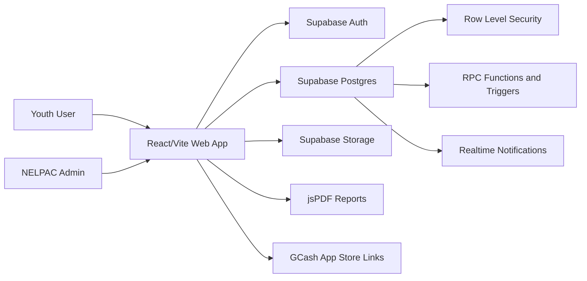
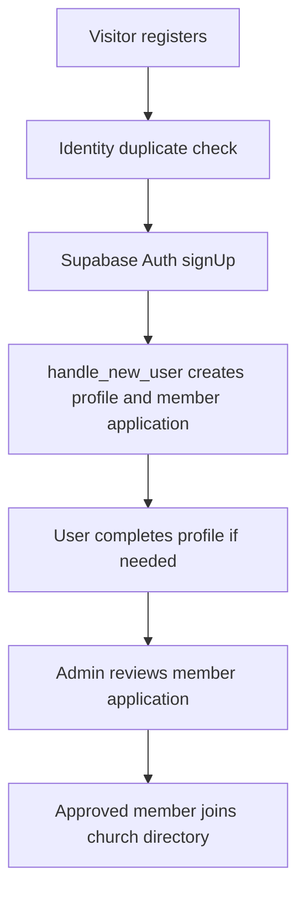
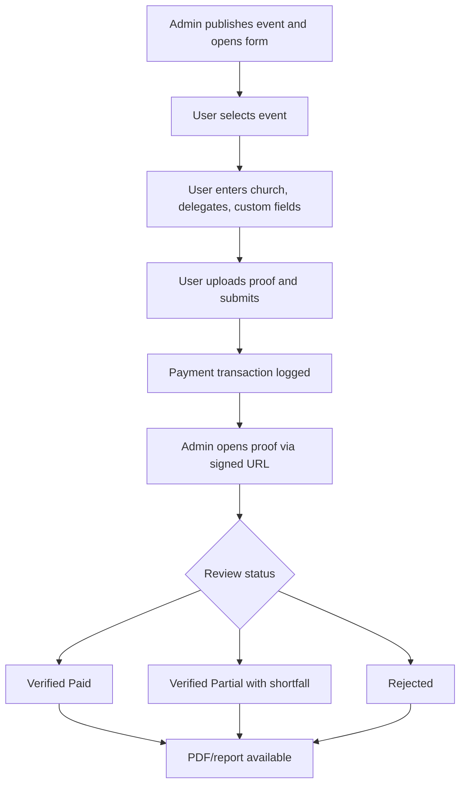
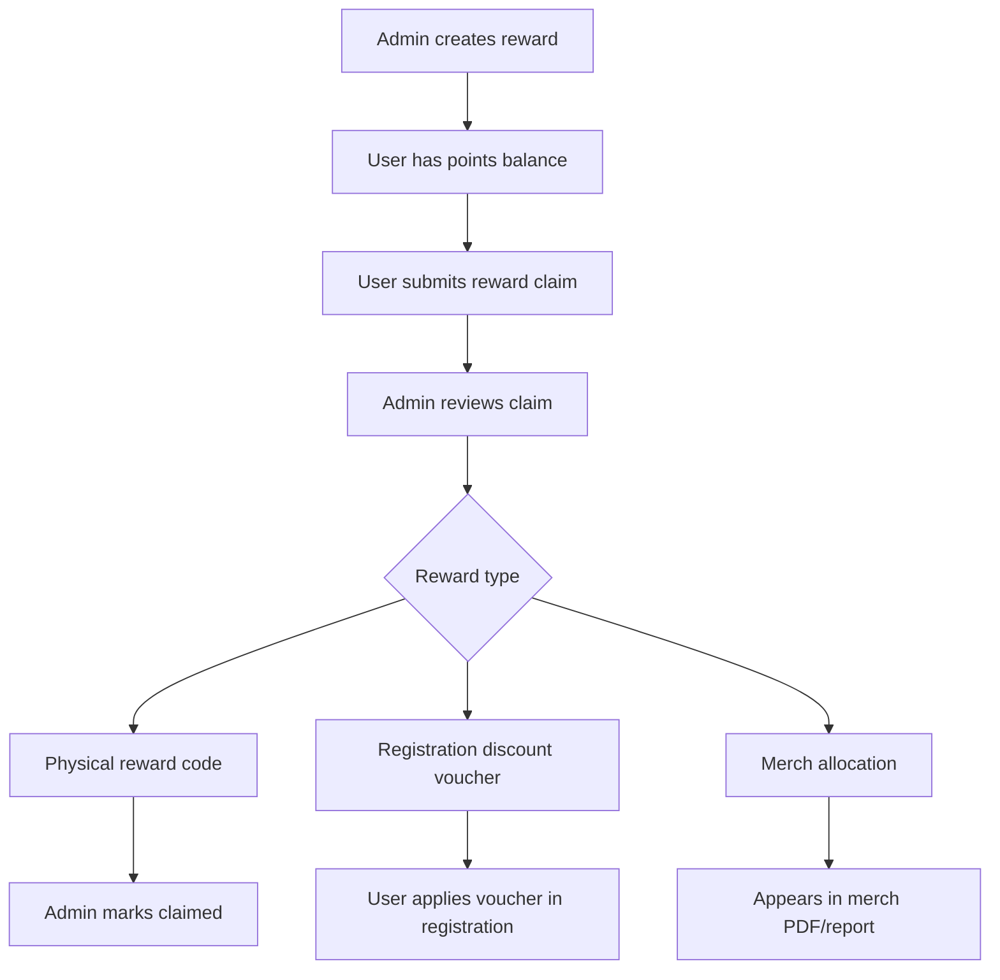

# NELPAC System Software Feature Documentation

## 1. Document Control

| Item | Details |
|---|---|
| System | NELPAC Youth Digital Platform |
| Source analyzed | React/Vite frontend, Supabase client/service layer, SQL schema and migration files |
| Primary stack | React 18, Vite, Tailwind CSS, Supabase Auth, Supabase Database, Supabase Storage, Supabase Realtime |
| Main source folders | `src/app`, root Supabase SQL files |
| Deployment hints | `vercel.json`, `vite.config.js`, `index.html` |

## 2. System Overview

NELPAC System is a web application for managing youth member records, events, event registrations, onsite participants, merchandise pre-orders, evaluations, community images, posts, notifications, and a One Card rewards/points program.

The application is a client-rendered React app. It uses Supabase for authentication, database persistence, storage, realtime updates, row-level security, and business-process RPC functions.

## 3. User Roles and Permissions

| Role | Source | Permissions |
|---|---|---|
| Public visitor | Unauthenticated routes | Login, register, request password reset, complete password reset |
| User / Youth Portal | `profiles.role = 'user'` | Manage profile, submit local church member applications, view own church directory, view public events/posts/gallery, submit forms, upload images for review, submit evaluations, redeem points codes, claim rewards, view own notifications |
| Admin | `profiles.role = 'admin'` | Full administrative workspace: manage members, content, forms, submissions, payments, evaluations, images, One Card points/rewards/codes/claims, delegates, onsite participants, settings/audit logs |

Client-side layouts redirect by role:

| Layout | Rule |
|---|---|
| `AdminLayout` | Requires authenticated profile with role `admin`; users are redirected to `/user`; unauthenticated visitors to `/` |
| `UserLayout` | Requires authenticated non-admin profile; admins redirect to `/admin`; users with incomplete profile details are forced to `/user/profile?completeName=1&mandatory=1` |

Database-side security uses Supabase RLS policies and admin-only RPC guards such as `public.is_admin()`.

## 4. Navigation Structure

| Area | Route | Page / Feature |
|---|---|---|
| Public | `/` | Login |
| Public | `/register` | Registration wizard |
| Public | `/forgot-password` | Password reset request |
| Public | `/reset-password` | Password reset completion |
| Admin | `/admin` | Admin dashboard |
| Admin | `/admin/youth-database` | Church member database |
| Admin | `/admin/one-card` | One Card codes, rewards, claims |
| Admin | `/admin/events` | Events, posts, activities |
| Admin | `/admin/forms` | Form setup and payment verification |
| Admin | `/admin/evaluations` | Evaluation analytics |
| Admin | `/admin/image-submissions` | Gallery moderation |
| Admin | `/admin/delegates` | Delegate roster and group randomizer |
| Admin | `/admin/settings` | Admin settings and audit logs |
| User | `/user` | User dashboard |
| User | `/user/profile` | Profile and password management |
| User | `/user/one-card` | One Card and rewards center |
| User | `/user/local-church-members` | Local church member directory/application |
| User | `/user/events` | Events, posts, activities |
| User | `/user/forms` | Forms center |
| User | `/user/payment-confirmation` | Submission/payment confirmation |
| User | `/user/evaluations` | Event evaluation form |
| User | `/user/gallery` | Gallery and image submission |
| User | `/user/settings` | User settings |

Legacy redirects exist for older post, rewards, image, registration, and merch routes.

## 5. System Modules

| Module | Implemented Features |
|---|---|
| Authentication | Email/password login, Google OAuth, registration, forgot password, reset password, sign out, role-based redirects |
| Profile Management | Profile photo upload, complete full name capture, mobile number validation, local church selection, password change |
| Local Church Directory | User member application, church-scoped directory, admin review, duplicate detection, approval/rejection logs |
| Events & Posts | Admin CRUD-style create/update, image upload, publication statuses, event evaluation toggle, user browsing |
| Forms Center | Admin setup for pre-registration, onsite registration, merch preorder; user submission flow; custom fields |
| Payment Verification | GCash/manual payment capture, proof upload, signed proof URLs, admin status review, shortfall tracking |
| Merchandise | Merch form creation, shirt colors/sizes, lace/custom items, order supplements, merch analytics |
| Evaluations | Six-category star ratings, comments, one submission per event/user, points award, admin analytics |
| One Card | Points ledger, admin points entries, earning codes, user redeem, reward catalog, claims, vouchers |
| Gallery | User image upload, compression, event/church association, admin moderation, approved gallery |
| Notifications | Realtime-backed notification center, unread panel, mark one/all read |
| Reports | Merged PDF per church submission, overall PDFs, analytics views, dashboard KPIs |
| Delegates | Unified roster from registration, supplements, onsite participants; demographic analytics; group randomizer |
| Settings / Audit | Theme preference, audit log listing, admin role setting service present |

## 6. Functional Requirements

| ID | Requirement | Implementation |
|---|---|---|
| FR-01 | The system shall authenticate users using email/password. | Supabase `signInWithPassword` |
| FR-02 | The system shall support Google OAuth login. | `signInWithOAuth({ provider: "google" })` |
| FR-03 | The system shall create profiles on auth signup. | `handle_new_user()` trigger |
| FR-04 | The system shall route admins and users to separate portals. | `AdminLayout`, `UserLayout`, `LoginPage` |
| FR-05 | The system shall require complete profile information before user workflows. | `UserLayout`, `UserProfile`, `hasCompleteProfileName` |
| FR-06 | Users shall submit local church member applications. | `LocalChurchMembers`, `createMember`, `update_my_member_application` |
| FR-07 | Admins shall approve/reject member applications. | `YouthDatabase`, `admin_review_member_application` |
| FR-08 | Admins shall create events and posts with images and statuses. | `EventsManagement`, `PostsManagement` |
| FR-09 | Users shall browse published/completed events and published posts. | `UserEvents`, `UserPosts` |
| FR-10 | Admins shall configure event registration and onsite forms. | `PreRegistrationManagement` |
| FR-11 | Users shall submit event pre-registration and onsite registration forms. | `EventPreRegistration` |
| FR-12 | Users shall add supplemental event submissions after initial submission. | `event_registration_supplements` |
| FR-13 | Admins shall create merch pre-order forms. | `MerchPreordersManagement` |
| FR-14 | Users shall submit merch preorders and supplemental orders. | `MerchPreorderForm` |
| FR-15 | Users shall upload payment proof images. | private Supabase buckets and `uploadPrivatePaymentProof` |
| FR-16 | Admins shall verify payment statuses as pending, partial, verified, or rejected. | `RegistrationAnalytics`, payment review triggers |
| FR-17 | The system shall generate PDFs for registration and merch submissions. | `pdfExports.js` |
| FR-18 | Users shall submit event evaluations. | `UserEvaluation`, `submit_event_evaluation` |
| FR-19 | Evaluation completion shall award One Card points. | `evaluation_reward_history`, `one_card_points` |
| FR-20 | Admins shall manage One Card codes and member points. | `NelpacOneCardAdmin` |
| FR-21 | Users shall redeem One Card codes. | `redeem_one_card_code` |
| FR-22 | Admins shall manage rewards and review claims. | `RewardsManagement`, `admin_review_reward_claim` |
| FR-23 | Users shall claim rewards using points. | `UserRewards`, `submit_reward_claim` |
| FR-24 | Approved discount rewards shall produce registration discount vouchers. | `registration_discount_vouchers` |
| FR-25 | Users shall submit gallery images and admins shall moderate them. | `SubmitImage`, `ImageSubmissions` |
| FR-26 | Users/admins shall receive and manage notifications. | `notifications`, `NotificationCenter` |
| FR-27 | Admins shall view delegate analytics and generate groups. | `Delegates` |

## 7. Non-Functional Requirements

| Category | Implemented / Expected Behavior |
|---|---|
| Security | Supabase Auth, RLS on core tables, admin RPC guards, private payment-proof buckets, signed URLs |
| Privacy | Password reset request returns generic success message to avoid email enumeration |
| Availability | Client uses polling fallback every 10 seconds plus Supabase realtime event dispatch |
| Performance | Indexed tables/views, image compression before upload, lazy PDF module imports |
| Responsiveness | Tailwind responsive layouts, mobile sidebars, mobile card/table alternatives |
| Auditability | Member review logs, audit logs, password reset activity, payment review metadata |
| Data integrity | Database constraints for phone patterns, age ranges, statuses, unique registration/order per church, one evaluation per event/user |
| Maintainability | Centralized Supabase service layer, reusable data loader hook, shared UI components |

## 8. Database Entities

| Entity / View | Purpose | Important Fields |
|---|---|---|
| `profiles` | Auth-linked user profile | `id`, `role`, `full_name`, `email`, `contact_number`, `local_church_id`, `avatar_url`, `name_completed` |
| `local_churches` | Church master list | `name`, `district`, `is_active` |
| `local_church_members` | Member applications/directory | `submitted_by`, `local_church_id`, `name`, `birthday`, `contact_number`, `gender`, `review_status`, `activity_status` |
| `member_review_logs` | Admin review history | `member_id`, `reviewed_by`, `previous_status`, `new_status`, `notes` |
| `events` | Event records | `title`, `description`, `event_date`, `venue`, `status`, `evaluation_enabled`, registration configuration/payment fields |
| `posts_or_announcements` | Posts and activities | `title`, `body`, `category`, `status`, `featured`, `image_url`, `published_at` |
| `event_registrations` | Church event registration parent | church officers, delegate counts, payment fields, voucher fields, `submission_status` |
| `event_registration_delegates` | Registration delegate rows | `registration_id`, `selected_member_id`, `name`, `age`, `gender`, `health_condition` |
| `event_registration_supplements` | Additional event submissions | parent registration, JSON delegate list, payment proof/status, custom responses |
| `onsite_event_participants` | Admin-added onsite roster entries | `event_id`, `local_church_id`, `name`, `participant_role`, `age`, `gender` |
| `merch_preorder_forms` | Merch form setup | title, date, deadline, image, type, fee, slug, status, guide, GCash fields, `form_config` |
| `merch_preorders` | Church merch preorder parent | church president, total quantity, payment fields, custom responses |
| `merch_shirt_order_items` | Shirt variant quantities | `preorder_id`, `color`, `size`, `quantity` |
| `merch_preorder_supplements` | Additional merch submissions | parent preorder, JSON order items, payment fields |
| `payment_transactions` | Payment proof/transaction log | provider, module, source table/id, amount, payer, reference, proof path, status |
| `event_evaluations` | User event feedback | six rating fields, comment, event/user uniqueness |
| `evaluation_reward_history` | Points awarded from evaluations | evaluation, event, user, points entry |
| `one_card_points` | Points ledger | user, entry type, points, description, event |
| `one_card_redeem_codes` | Admin-created earning codes | code, points, claim limit, expiry, active flag |
| `one_card_redeem_code_claims` | Earning code claims | redeem code, user, points awarded |
| `rewards` | Reward catalog | name, type, points, stock, image, merch connection, discount config |
| `reward_claims` | User reward claims | user, reward, status, points used, claimant/church snapshot, selected size |
| `redeem_codes` | Physical reward collection codes | claim, user, code, used flag |
| `registration_discount_vouchers` | Discount voucher rewards | claim, user, event, code, percentage, allowed registration types, used state |
| `reward_merch_allocations` | Approved merch reward allocations | claim, user, local church, merch form, reward metadata |
| `image_submissions` | Community image uploads | submitter, event, church, URL, caption, moderation status |
| `notifications` | User/admin notifications | user, title, message, type, read flag |
| `audit_logs` | Admin action trail | admin, action, table, record, old/new data |
| `password_reset_activity` | Password reset audit/rate data | user/email hash, activity type, success, detail |

## 9. Views and Analytics

| View | Purpose |
|---|---|
| `local_church_members_with_church` | Member details joined with local church/district and computed age |
| `one_card_point_balances` | Aggregated point balances by user |
| `reward_claims_with_rewards` | Claim records with reward, claimant, voucher, and church metadata |
| `one_card_redeem_codes_with_usage` | Earning codes with used count and event title |
| `event_registration_analytics` | Event registration counts, delegates, expected/verified totals |
| `merch_preorder_analytics` | Merch order churches, quantities, expected/verified totals |
| `merch_shirt_variant_analytics` | Shirt color/size totals |
| `event_evaluation_details` | Event evaluation details with event/user metadata |
| `event_evaluation_analytics` | Evaluation aggregate scores per event |
| `event_evaluation_rating_distribution` | Rating distribution by event/category |

## 10. API / Service Layer

This app does not define custom HTTP endpoints in the repository. The API boundary is Supabase table/view access, storage access, and RPC functions.

| Service Function | Backend Target | Purpose |
|---|---|---|
| `listProfiles` | `profiles` | List profile basics |
| `listLocalChurches` | `local_churches` | Church lookup/filtering |
| `createMember` | `local_church_members` | Submit member application |
| `reviewMember` | `admin_review_member_application` | Admin approve/reject |
| `saveEvent` | `events` | Create/update event |
| `updateEventPreRegistration` | `events` | Update form settings |
| `submitEventRegistration` | `event_registrations`, `event_registration_delegates` | Draft-and-submit registration |
| `appendEventRegistrationSupplement` | `event_registration_supplements` | Add follow-up delegate submission |
| `saveMerchForm` | `merch_preorder_forms` | Create/update merch form |
| `submitMerchPreorder` | `merch_preorders`, `merch_shirt_order_items` | Submit merch order |
| `appendMerchPreorderSupplement` | `merch_preorder_supplements` | Add follow-up merch order |
| `createPaymentTransaction` | `payment_transactions` | Record payment proof metadata |
| `updateEventRegistrationPayment` | `event_registrations` | Admin payment review |
| `updateMerchPreorderPayment` | `merch_preorders` | Admin payment review |
| `updateSupplementPayment` | supplement tables | Admin payment review for added submissions |
| `createPaymentProofSignedUrl` | Supabase Storage | Open private proof for admin review |
| `submitEvaluation` | `submit_event_evaluation` | Submit evaluation and award points |
| `createPointsEntry` | `admin_create_points_entry` | Admin points entry |
| `saveOneCardRedeemCode` | code RPCs | Create/update earning code |
| `redeemOneCardCode` | `redeem_one_card_code` | User code redemption |
| `submitRewardClaim` | `submit_reward_claim` | User reward claim |
| `reviewRewardClaim` | `admin_review_reward_claim` | Admin claim review |
| `markRewardClaimClaimed` | `admin_mark_reward_claim_claimed` | Mark reward fulfilled |
| `uploadImageSubmission` | Storage + `image_submissions` | Submit gallery image |
| `reviewImageSubmission` | `admin_review_image_submission` | Moderate gallery |
| `markNotificationRead` | `mark_notification_read` | Notification read state |
| `logPasswordResetActivity` | `log_password_reset_activity` | Password reset audit |

## 11. Forms and Fields

| Form | Major Fields | Validation |
|---|---|---|
| Login | Email, password | Required, email type |
| Registration wizard | First/middle/last name, birthday, gender, contact, address, guardian, emergency contact, district, local church, membership status, confirmation status/year, activity status, email, password, profile photo | Required-field checks, PH mobile `09XXXXXXXXX`, password match, min length 6 in manual registration, duplicate email/contact/member checks |
| Forgot password | Email | Required, email type, local 60-second cooldown, generic success response |
| Reset password | Password, confirm password | Minimum 8 chars, uppercase, lowercase, number, symbol, match |
| Profile | First/middle/last name, contact, local church, avatar, new password | Required first/last/contact/church when editing, mobile pattern, password min 6/match |
| Local church member | Name, birthday, contact, emergency contact, gender, address, guardian, professing member, confirmation year/status, activity status | Required fields, PH mobile validation, profile church required, duplicate protection in DB |
| Event form setup | Enable switch, mode, fee, deadline, slug, GCash recipient/number, section titles, guide, custom sections | GCash recipient/number required when enabled; custom field labels required |
| Event registration | Church info, worker/president contacts, delegate rows, custom fields, payment details, proof image, voucher code | Complete profile required, registered church required, mobile validation, at least one delegate, delegate name/age, proof image required for non-cash, JPG/PNG/WebP <= 10 MB |
| Merch form setup | Title, date, deadline, type, custom name, fee, status, slug, description, guide, image, GCash fields, shirt colors, custom sections | Required title/date/fee; custom name for Others; GCash fields if published; shirt color required for Shirt; custom labels required |
| Merch preorder | Church president/contact, shirt color-size quantities or total quantity, custom fields, payment details, proof image | Complete profile, church required, mobile validation, quantity > 0, selected color from configured list, proof required |
| Event evaluation | Event, six 1-5 ratings, comment | All ratings required, event must be evaluation-enabled, one per event/user |
| Reward admin | Reward type, name, required points, stock, sizes, discount event/types, image, active flag | Points > 0, stock >= 0, shirt size required, discount event/type required |
| Reward claim | Reward, optional shirt size | Sufficient balance, stock, active reward, valid size |
| Image submission | File, event, caption | File required; uploaded image compressed |
| Onsite participant | Name, role, local church, age, gender, contact, notes | Name required; delegate age/gender required |

## 12. Core Workflows

### Registration and Profile

### Event Registration Payment Review

### One Card Reward Claim

## 13. Reports and Dashboard Widgets

| Area | Widgets / Reports |
|---|---|
| Login page | Public stats: registered youth, active churches, completed events, total points issued |
| Admin dashboard | Members, active churches, events, pending images, published posts, reward claims; recent applications; event list |
| User dashboard | Welcome/profile church, points, quick actions, upcoming events, latest post, reward claims, next-event countdown |
| Youth database | Total members, district counts, highest/lowest local church, pending review, filtered/paginated member table |
| Registration analytics | Church submissions, delegates/items, expected payment, verified paid total, proof links, payment editors |
| Merch analytics | Shirt variant totals, reward merch allocations, merged and overall PDF exports |
| Evaluation analytics | Event score cards, category averages, rating distribution chart, comments, all-events overview |
| Delegates | Participants, delegates, gender counts, age brackets, staff/officers, largest delegation, roster table |
| PDF exports | Individual merged PDFs and overall PDFs for event registrations and merch preorders |

## 14. Notifications

| Trigger / Event | Recipient |
|---|---|
| Published post | Users |
| Event changes | Users |
| Published merch form | Users |
| Event registration submission | Admins |
| Merch preorder submission | Admins |
| Event/merch supplement submission | Admins |
| Member review result | User |
| Image review result | User |
| Reward claim submitted/reviewed | User/Admin depending on process |
| Points/evaluation actions | User via points refresh and notifications where implemented |

Notification UI displays only unread items, supports mark-one-read, mark-all-read, refresh, relative time, and unread badge count.

## 15. File Uploads and Downloads

| Feature | Storage / Library | Notes |
|---|---|---|
| Profile avatars | `nelpac-images` | Public URL, compressed client-side |
| Community gallery images | `nelpac-images` | Public URL after upload; visibility moderated by DB status |
| Event images | `event-images` | Public admin media bucket |
| Post images | `post-images` | Public admin media bucket |
| Reward images | `reward-images` | Public admin media bucket |
| Merch images | `merch-images` | Public merch bucket |
| Registration payment proof | `registration-payment-proofs` | Private; opened by signed URL |
| Merch payment proof | `merch-payment-proofs` | Private; opened by signed URL |
| PDF downloads | `jsPDF`, `jspdf-autotable` | Registration/merch individual and overall reports |

## 16. Security Mechanisms

| Mechanism | Details |
|---|---|
| Authentication | Supabase email/password and Google OAuth |
| Authorization | Profile role plus RLS policies and admin RPC checks |
| RLS | Enabled on profiles, churches, members, events, evaluations, images, points, rewards, claims, notifications, registrations, preorders, payments, supplements, onsite participants |
| Admin-only writes | Protected by `public.is_admin()` policies/RPCs |
| Ownership rules | Users can select own records, submit own forms, update own drafts, view own notifications/claims |
| Private payment proofs | Stored in private buckets; admins open via 10-minute signed URLs |
| Password reset privacy | Generic message prevents account enumeration |
| Password reset URL safety | Production reset URL must be HTTPS except localhost |
| Mobile validation | Client and database checks enforce `09[0-9]{9}` where applicable |
| Duplicate prevention | Unique email/contact, member name+birthday/contact checks, one registration/order per church parent record, one evaluation per event/user, one code claim per user |
| Audit trails | `audit_logs`, `member_review_logs`, `password_reset_activity`, payment review metadata |

## 17. Error Handling

| Area | Behavior |
|---|---|
| Data loading | `useSupabaseData` exposes loading/error states and silent refresh |
| Forms | Client validation messages before submission; database/RPC errors mapped to friendly messages in key workflows |
| Auth | Login hides raw errors; reset flow handles invalid/expired links |
| Storage | Missing bucket errors include setup guidance for several buckets |
| Payment proof | File type/size errors shown before upload |
| Vouchers/codes | Domain-specific errors for invalid/used/expired/limit conditions |
| Realtime | Channel errors logged to console; polling fallback still refreshes |

## 18. External Services and Integrations

| Service | Use |
|---|---|
| Supabase Auth | Users, sessions, OAuth, password reset |
| Supabase Postgres | Application database |
| Supabase Storage | Public images and private payment proofs |
| Supabase Realtime | Change notifications and refresh events |
| Google OAuth | Sign in / registration option |
| GCash | Manual payment instruction/redirection; opens GCash app store link, not a payment API |
| Vercel | Deployment target indicated by reset URL and `vercel.json` |

## 19. Missing or Incomplete Features

| Gap | Evidence / Impact |
|---|---|
| No custom backend HTTP API | All operations are client-to-Supabase; sensitive workflows rely on RLS/RPC correctness |
| Manual GCash only | `payment_provider` fields exist, but webhook flags are disabled and no gateway checkout/webhook implementation exists |
| Payment transaction review not synchronized everywhere | Admin updates registration/preorder tables, while `payment_transactions` captures submissions but is not surfaced as a full reconciliation module |
| Terms/privacy checkbox is not enforced | Registration page displays a checkbox but it is not required or stored |
| Some password policy inconsistency | Registration accepts minimum 6 characters; reset password requires stronger 8-character complexity |
| Admin settings are minimal | Role-setting service exists, but full role/user administration is limited in visible pages |
| Delete/archive support uneven | Rewards archive exists; events/posts/merch/member records mostly edit/review but do not expose full deletion/archive everywhere |
| Some older files are unused or redirected | Legacy pages/components exist alongside unified centers |
| SQL migrations are split | Current database state depends on running multiple SQL files in correct order |
| No automated tests found | No test scripts or test files are present in `package.json`/source inventory |
| No server-side file malware scanning | Images are type/size/compressed client-side, but no antivirus or content moderation automation is implemented |
| GCash number format not strongly validated in admin setup | Some GCash recipient numbers are plain numeric text inputs rather than the shared PH mobile validator |

## 20. Recommendations

| Priority | Recommendation |
|---|---|
| High | Add automated tests for auth redirects, form validation, payment review, voucher redemption, reward claims, and RLS-critical RPC behavior |
| High | Consolidate SQL migrations into an ordered migration folder with a documented baseline and migration history |
| High | Enforce the Terms/Privacy agreement if it is legally required; store timestamp/version in the database |
| High | Build a payment reconciliation page around `payment_transactions` or synchronize status updates to transaction rows |
| High | Standardize password rules between registration and reset flows |
| Medium | Add structured admin user management for role changes, account search, and account de-duplication status |
| Medium | Add CSV/XLSX exports for youth database, delegate roster, payment reviews, evaluations, and reward claims |
| Medium | Add admin notes input to member/image review modals where RPCs support notes |
| Medium | Add expiry/deadline UI enforcement to merch published forms if deadline should close submissions |
| Medium | Validate GCash/phone fields consistently with shared phone utilities |
| Medium | Add image upload progress indicators and server-side size/type enforcement documentation |
| Low | Remove or archive legacy/unused route files after confirming redirects cover historical links |
| Low | Add user-facing notification history page for read notifications |
| Low | Add print-friendly delegate group reports from the group randomizer |

